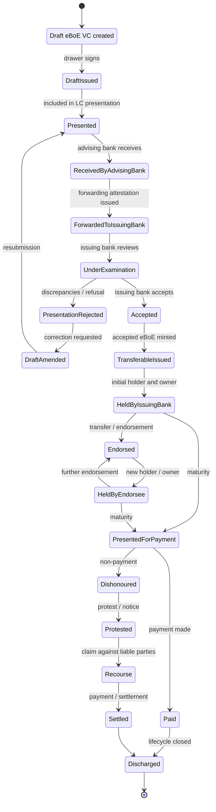

## Summary

Below is a **formal eBoE Interoperability Specification v0.1** and a **lifecycle state machine diagram**.

This version treats TrustVC / TradeTrust as a **framework**, not a platform. The intent is to let banks, trade platforms, fintechs, and other solution providers **clone/reference TrustVC and TradeTrust implementations** and still produce interoperable eBoE artefacts, similar to the way ETR interoperability works in TradeTrust.

The PDF is used only as the workflow prompt: draft eBoE, LC ePresentation, bank forwarding, issuing-bank acceptance, and accepted transferable eBoE. 

TradeTrust already describes itself as a framework for creating, exchanging, verifying digitised documents, and transferring ownership of title documents across digital platforms.  TradeTrust documentation also states that it is built using TrustVC as its base and uses W3C VCs, DIDs, blockchain, and ETR interoperability across digital platforms. ([docs.tradetrust.io][1])

---

# eBoE Interoperability Specification v0.1

## 1. Document Status

| Field               | Value                                  |
| ------------------- | -------------------------------------- |
| Name                | eBoE Interoperability Specification    |
| Version             | 0.1                                    |
| Status              | Draft                                  |
| Scope               | Framework-level interoperability       |
| Target users        | Banks, trade platforms, DTPs, fintechs |
| Base framework      | TrustVC / TradeTrust                   |
| Platform dependency | None                                   |

This specification does **not** define a hosted platform. It defines common artefacts, lifecycle states, verification rules, and transfer conventions so that independent solution providers can implement interoperable eBoE workflows using TrustVC / TradeTrust reference implementations.

The accessible `trustvc-portfolio` repository positions TrustVC as a shared trust layer and explicitly says it is **not** the source-of-truth implementation repository for TrustVC itself. It is a strategy and portfolio artefact, not the production framework implementation. 

---

## 2. Objectives

The specification aims to enable:

1. **Interoperable draft eBoE issuance**
2. **Interoperable LC ePresentation referencing**
3. **Bank-to-bank forwarding attestations**
4. **Acceptance by issuing bank**
5. **Creation of accepted transferable eBoE**
6. **Negotiation / endorsement through token transfer**
7. **Independent verification by any party**
8. **No dependency on a single platform**

---

## 3. Non-Goals

This specification does **not** define:

* LC workflow engines
* Bank UI screens
* SWIFT / ISO 20022 integration
* Compliance decisioning
* Sanctions screening
* Core banking integration
* Payment settlement
* Legal enforceability across all jurisdictions
* Hosted TrustVC services

Those remain solution-provider or bank responsibilities.

---

## 4. Core Design Principle

An eBoE implementation should follow the ETR pattern:

> The framework defines the interoperable document, verification, status, and transfer model.
> Platforms compete on workflow, UX, integrations, compliance, and operations.

TradeTrust already distinguishes non-transferable **verifiable documents** from **transferable documents** such as ETRs. Verifiable documents include non-transferable trade documents, while transferable documents are title documents whose ownership can be transferred from one party to another.

---

# 5. Parties and Roles

## 5.1 Commercial Roles

| Role     | Meaning                 |
| -------- | ----------------------- |
| Seller   | Exporter                |
| Buyer    | Importer                |
| Drawer   | Party issuing the BoE   |
| Drawee   | Party ordered to pay    |
| Payee    | Party to be paid        |
| Holder   | Current possessor       |
| Owner    | Current title owner     |
| Endorser | Transferor              |
| Endorsee | Transferee              |
| Acceptor | Drawee after acceptance |

A bill of exchange normally involves a drawer, drawee, and payee. The drawer makes the instrument, the drawee is directed to pay, and the payee is the party to whom payment is directed. After the drawee signs assent, the drawee becomes the acceptor.

## 5.2 LC Roles

| Role             | Meaning                    |
| ---------------- | -------------------------- |
| Applicant        | Buyer                      |
| Beneficiary      | Seller                     |
| Issuing Bank     | Buyer’s bank               |
| Advising Bank    | Seller-side notifying bank |
| Negotiating Bank | Bank that may finance      |
| Confirming Bank  | Bank adding confirmation   |
| Presenting Bank  | Bank submitting documents  |

## 5.3 TrustVC / TradeTrust Roles

| Role                 | Meaning              |
| -------------------- | -------------------- |
| VC issuer            | Signs document       |
| VC subject           | Entity described     |
| Verifier             | Checks document      |
| Token registry owner | Deploys registry     |
| Token owner          | Legal owner          |
| Token holder         | Possessor/controller |
| Renderer provider    | Displays document    |
| Schema provider      | Publishes schema     |

---

# 6. Artefact Types

## 6.1 Draft eBoE VC

| Field          | Value               |
| -------------- | ------------------- |
| Type           | Non-transferable VC |
| Issuer         | Drawer / exporter   |
| Transferable   | No                  |
| Token Registry | No                  |
| Status         | VC status           |
| Purpose        | Draft payment order |

The draft eBoE is a verifiable document. TrustVC / TradeTrust already supports verifiable documents, DID signing, and verification. DID-issued documents rely on the integrity and signature of the document, while blockchain-issued documents can rely on document store commitments.

### Required fields

```json
{
  "type": ["VerifiableCredential", "TradeTrustDocument", "DraftEBoE"],
  "issuer": "did:web:exporter.example",
  "credentialSubject": {
    "drawer": "did:web:exporter.example",
    "drawee": "did:web:issuing-bank.example",
    "payee": "did:web:exporter.example",
    "amount": {
      "currency": "USD",
      "value": "100000.00"
    },
    "paymentTerms": "90 days after sight",
    "lcReference": "LC-2026-0001",
    "issueDate": "2026-05-05",
    "placeOfIssue": "Singapore",
    "termsAndConditionsHash": "sha256-..."
  },
  "credentialStatus": {
    "type": "BitstringStatusListEntry"
  }
}
```

---

## 6.2 LC Presentation Manifest

| Field        | Value                |
| ------------ | -------------------- |
| Type         | Manifest             |
| Issuer       | Exporter or platform |
| Transferable | No                   |
| Status       | Optional             |
| Purpose      | Bundle reference     |

The LC Presentation Manifest is not the LC workflow itself. It is an interoperable reference object that allows any verifier to confirm which documents were included in a presentation package.

### Required fields

```json
{
  "type": ["VerifiableCredential", "LCPresentationManifest"],
  "issuer": "did:web:exporter-platform.example",
  "credentialSubject": {
    "presentationId": "urn:uuid:...",
    "lcReference": "LC-2026-0001",
    "presenter": "did:web:exporter.example",
    "presentedTo": "did:web:advising-bank.example",
    "documents": [
      {
        "documentType": "DraftEBoE",
        "hash": "sha256-...",
        "uri": "optional"
      },
      {
        "documentType": "ElectronicBillOfLading",
        "hash": "sha256-...",
        "uri": "optional"
      },
      {
        "documentType": "CommercialInvoice",
        "hash": "sha256-..."
      }
    ],
    "submittedAt": "2026-05-05T10:00:00+08:00"
  }
}
```

---

## 6.3 Forwarding Attestation VC

| Field        | Value            |
| ------------ | ---------------- |
| Type         | VC               |
| Issuer       | Advising bank    |
| Transferable | No               |
| Status       | Optional         |
| Purpose      | Chain of custody |

This is a framework-level enhancement. It allows an advising bank to attest that it received and forwarded a specific presentation package to an issuing bank.

### Required fields

```json
{
  "type": ["VerifiableCredential", "ForwardingAttestation"],
  "issuer": "did:web:advising-bank.example",
  "credentialSubject": {
    "presentationManifestHash": "sha256-...",
    "forwardedFrom": "did:web:advising-bank.example",
    "forwardedTo": "did:web:issuing-bank.example",
    "lcReference": "LC-2026-0001",
    "forwardedAt": "2026-05-05T12:00:00+08:00",
    "forwardingPurpose": "LC document forwarding"
  }
}
```

---

## 6.4 Accepted eBoE Transferable Record

| Field          | Value                    |
| -------------- | ------------------------ |
| Type           | Transferable record      |
| Issuer         | Issuing bank             |
| Transferable   | Yes                      |
| Token Registry | Yes                      |
| Purpose        | Accepted negotiable eBoE |

This is the critical artefact. The accepted eBoE should be a **new transferable record** issued by the accepting bank. It should reference the draft eBoE hash and presentation manifest hash.

TradeTrust transferable records extend verifiable documents to allow an owner and holder. They use a Token Registry and Title Escrow model.  TradeTrust document status checking also supports transferable records through Token Registry and non-transferable records through Bitstring credential status.

### Required fields

```json
{
  "type": [
    "VerifiableCredential",
    "TradeTrustDocument",
    "TransferableRecord",
    "AcceptedEBoE"
  ],
  "issuer": "did:web:issuing-bank.example",
  "credentialSubject": {
    "acceptedEBoEId": "urn:uuid:...",
    "draftEBoEHash": "sha256-...",
    "presentationManifestHash": "sha256-...",
    "drawer": "did:web:exporter.example",
    "drawee": "did:web:issuing-bank.example",
    "acceptor": "did:web:issuing-bank.example",
    "payee": "did:web:exporter.example",
    "amount": {
      "currency": "USD",
      "value": "100000.00"
    },
    "paymentTerms": "90 days after sight",
    "maturityDate": "2026-08-03",
    "lcReference": "LC-2026-0001",
    "acceptanceDate": "2026-05-05",
    "negotiability": "toOrder"
  },
  "transferableRecord": {
    "tokenRegistry": "0x...",
    "tokenId": "0x...",
    "titleEscrow": "0x..."
  }
}
```

---

## 6.5 Lifecycle Event VC

| Field        | Value        |
| ------------ | ------------ |
| Type         | VC           |
| Issuer       | Event actor  |
| Transferable | No           |
| Purpose      | Auditability |

Lifecycle events should be signed attestations. They should not mutate the historic facts inside earlier credentials.

### Event types

| Event       | Issuer                    |
| ----------- | ------------------------- |
| Presented   | Exporter / platform       |
| Forwarded   | Advising bank             |
| Accepted    | Issuing bank              |
| Rejected    | Issuing bank              |
| Endorsed    | Current owner             |
| Discharged  | Paying party / bank       |
| Dishonoured | Holder / presenting party |
| Cancelled   | Issuer / registry owner   |

---

# 7. Interoperability Requirements

## 7.1 Identity

Each regulated party should have a resolvable DID.

| Party            | DID required |
| ---------------- | ------------ |
| Exporter         | Yes          |
| Advising bank    | Yes          |
| Issuing bank     | Yes          |
| Negotiating bank | Yes          |
| Importer         | Recommended  |
| Platform         | Recommended  |

## 7.2 Schema

Every eBoE artefact must declare:

```json
{
  "@context": [
    "https://www.w3.org/ns/credentials/v2",
    "https://trustvc.example/context/tradetrust/v5",
    "https://trustvc.example/context/eboe/v0.1"
  ],
  "type": [
    "VerifiableCredential",
    "DraftEBoE"
  ]
}
```

## 7.3 Hash Linking

The accepted eBoE must reference:

| Reference                   | Required    |
| --------------------------- | ----------- |
| Draft eBoE hash             | Yes         |
| Presentation manifest hash  | Yes         |
| Forwarding attestation hash | Recommended |
| LC reference                | Yes         |
| eBL hash                    | Optional    |

## 7.4 Verification Fragments

A verifier should produce a structured result.

```json
{
  "overall": "VALID",
  "fragments": [
    {
      "id": "signature",
      "status": "VALID"
    },
    {
      "id": "issuerIdentity",
      "status": "VALID"
    },
    {
      "id": "documentStatus",
      "status": "VALID"
    },
    {
      "id": "schema",
      "status": "VALID"
    },
    {
      "id": "tokenRegistry",
      "status": "VALID"
    },
    {
      "id": "holderOwner",
      "status": "VALID"
    },
    {
      "id": "draftReference",
      "status": "VALID"
    }
  ]
}
```

The `trustvc-portfolio` repo already contains a verifier-demo concept with verification fragments such as signature, issuer trust, status, schema/context, rendering, and optional chain proof. 

---

# 8. Capability Mapping

## 8.1 Already Solved by TrustVC / TradeTrust

| Capability           | Status   |
| -------------------- | -------- |
| W3C VC model         | Existing |
| DID identity         | Existing |
| Verifiable document  | Existing |
| Transferable record  | Existing |
| Token Registry       | Existing |
| Title Escrow         | Existing |
| Holder / owner model | Existing |
| Public verification  | Existing |
| Status verification  | Existing |
| Renderer pattern     | Existing |

TradeTrust’s current documentation says it supports authenticity, source verification, and title ownership for trade documents. ([docs.tradetrust.io][1]) It also supports seamless ownership transfer for documents such as eBLs across digital platforms.

## 8.2 TrustVC Framework Enhancements

| Enhancement             | Level     |
| ----------------------- | --------- |
| eBoE schema pack        | Framework |
| Lifecycle event types   | Framework |
| Forwarding attestation  | Framework |
| Presentation manifest   | Framework |
| eBoE verifier fragments | Framework |
| eBoE renderer template  | Framework |
| Test vectors            | Framework |
| Conformance suite       | Framework |
| Reference examples      | Framework |

## 8.3 Solution Provider Builds

| Component             | Owner           |
| --------------------- | --------------- |
| Exporter portal       | Provider        |
| Bank portal           | Provider        |
| LC workflow engine    | Bank / provider |
| Document examination  | Bank / provider |
| SWIFT integration     | Bank / provider |
| ISO 20022 integration | Bank / provider |
| Compliance checks     | Bank            |
| KYC / AML / sanctions | Bank            |
| Payment settlement    | Bank            |
| Dispute workflow      | Bank / legal    |
| Archive / retention   | Provider        |

---

# 9. Lifecycle State Machine



---

# 10. State Definitions

| State                  | Meaning            |
| ---------------------- | ------------------ |
| DraftCreated           | Draft prepared     |
| DraftIssued            | Drawer signed      |
| Presented              | Submitted under LC |
| ReceivedByAdvisingBank | Bank received      |
| ForwardedToIssuingBank | Forwarded          |
| UnderExamination       | Being reviewed     |
| PresentationRejected   | Refused            |
| DraftAmended           | Corrected          |
| Accepted               | Bank accepted      |
| TransferableIssued     | Token minted       |
| HeldByIssuingBank      | Bank owns/holds    |
| Endorsed               | Transferred        |
| HeldByEndorsee         | New holder         |
| PresentedForPayment    | Due for payment    |
| Paid                   | Payment made       |
| Discharged             | Closed             |
| Dishonoured            | Not paid           |
| Protested              | Protest recorded   |
| Recourse               | Recovery path      |
| Settled                | Resolved           |

---

# 11. Conformance Profiles

## C0 — Verifier Profile

Must verify:

* Signature
* Issuer DID
* Schema
* Status
* Hash integrity
* Renderer availability

## C1 — Draft eBoE Issuer Profile

Must support:

* DraftEBoE schema
* DID signing
* Non-transferability
* VC status
* Hash export

## C2 — Presentation Profile

Must support:

* LC Presentation Manifest
* Hash references
* Submission timestamp
* Document list
* Presenter identity

## C3 — Bank Forwarding Profile

Must support:

* ForwardingAttestation VC
* Advising bank DID
* Presentation manifest hash
* Forwarding timestamp
* Destination bank DID

## C4 — Accepted eBoE Transfer Profile

Must support:

* AcceptedEBoE schema
* Token Registry
* Title Escrow
* Owner / holder
* Draft hash reference
* Transfer / endorsement
* Discharge or cancellation path

---

# 12. Recommended Repository Enhancements

TrustVC itself should remain a framework. The repo additions should be reference artefacts, not platform code.

Suggested structure:

```text
trustvc-eboe/
  specs/
    eboe-interoperability-v0.1.md
    lifecycle-state-machine.md

  schemas/
    draft-eboe.schema.json
    accepted-eboe.schema.json
    lc-presentation-manifest.schema.json
    forwarding-attestation.schema.json
    lifecycle-event.schema.json

  contexts/
    eboe-v0.1.jsonld

  examples/
    draft-eboe.sample.json
    lc-presentation-manifest.sample.json
    forwarding-attestation.sample.json
    accepted-eboe.sample.json

  renderers/
    draft-eboe/
    accepted-eboe/

  conformance/
    fixtures/
    verifier-fragments/
    negative-tests/

  docs/
    implementation-guide.md
    provider-conformance-guide.md
```

---

# 13. Verification Rules

## Draft eBoE

A Draft eBoE is valid only if:

1. Signature is valid.
2. Drawer DID resolves.
3. Schema is recognised.
4. Status is not revoked.
5. Mandatory fields are present.
6. It is marked non-transferable.

## Forwarding Attestation

A forwarding attestation is valid only if:

1. Advising bank DID resolves.
2. Presentation manifest hash matches.
3. Forwarded-to party is identified.
4. Timestamp exists.
5. Signature is valid.

## Accepted eBoE

An Accepted eBoE is valid only if:

1. Issuing bank DID resolves.
2. Transferable record is minted.
3. Token Registry is valid.
4. Token ID matches the VC ID hash convention.
5. Draft eBoE hash resolves.
6. Presentation manifest hash resolves.
7. Holder / owner can be determined.
8. Status is active.
9. Maturity is not discharged or cancelled.

---

# 14. Implementation Recommendation

## TrustVC / Framework Maintainers

Should implement:

* eBoE schemas
* eBoE JSON-LD context
* eBoE renderer reference
* eBoE verifier fragments
* lifecycle event vocabulary
* conformance fixtures
* reference examples

## Solution Providers

Should implement:

* workflow UI
* bank-specific checks
* LC processing
* document routing
* KMS / wallet integration
* SWIFT / ISO 20022 integration
* audit logs
* role-based access
* production monitoring

## Banks

Should define:

* acceptance policy
* signing authority
* payment rules
* discharge rules
* recourse handling
* retention requirements
* legal enforceability position

---

# 15. Open Questions for v0.2

1. Should the accepted eBoE be payable to order, bearer, or named payee only?
2. Should token holder and owner always be the same for eBoE?
3. Should acceptance be a new VC, a token event, or both?
4. Should dishonour be represented by VC status or separate event VC?
5. Should discharge burn the token or mark it inactive?
6. Should LC presentation manifests be mandatory for accepted eBoE issuance?
7. Should bank forwarding be a required conformance profile?
8. Which DID methods are acceptable for regulated banks?
9. Should Token Registry v5 remark fields carry lifecycle semantics?
10. Should the eBoE renderer include jurisdiction-specific legal text?

---

## Recommendation

Proceed with a **framework extension**, not a platform build.

The minimum viable TrustVC enhancement is:

1. `DraftEBoE` schema
2. `AcceptedEBoE` schema
3. `LCPresentationManifest` schema
4. `ForwardingAttestation` schema
5. eBoE lifecycle vocabulary
6. verifier-fragment profile
7. conformance fixtures

That is enough for solution providers to build interoperable eBoE workflows while preserving the TrustVC / TradeTrust model: open framework, decentralised implementation, independent verification, and ETR-like cross-platform interoperability.

[1]: https://docs.tradetrust.io/?utm_source=chatgpt.com "What is TradeTrust? | TradeTrust Documentation"
